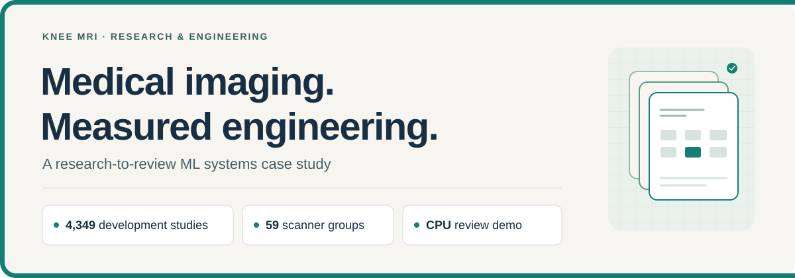
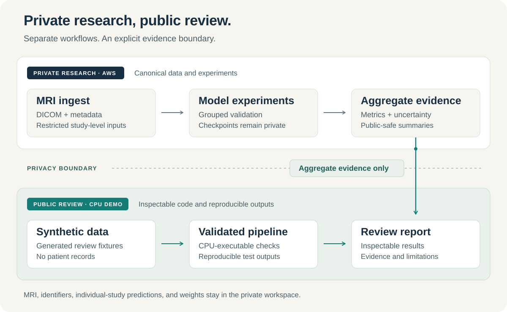

# RSNA Knee Abnormality Detection

[](https://github.com/alvaromendizabal/rsna-knee-abnormality-detection/actions/workflows/publication-checks.yml)
[](https://github.com/alvaromendizabal/rsna-knee-abnormality-detection/actions/workflows/public-quality.yml)



**An engineering case study by Alvaro Mendizabal: building a reproducible research system for twelve knee-MRI findings.**

The difficult work extended beyond fitting a model. Heterogeneous acquisitions, scanner effects, inherited model components and expensive cloud execution required explicit data contracts, controlled comparisons and reliable recovery. I designed the validation and experiment workflow, integrated existing image-model families, investigated representation changes, and built the artifact, testing and reporting layers around them.

**This portfolio release is complete.** It includes a runnable public CPU pipeline, tested research helpers, executed aggregate notebooks and a documented evidence boundary. The [closeout](docs/PROJECT_CLOSEOUT.md) defines the finished scope.

## What I built

- **Validation that follows the data.** Scanner-disjoint development folds, target/schema checks, lineage audits and paired uncertainty distinguish model-selection evidence from independent confirmation.
- **Recoverable ML execution.** Content fingerprints, validated checkpoints, atomic artifact writes and explicit resume behavior preserve completed work when later steps stop.
- **Controlled modeling experiments.** Cross-slice context studies, matched controls and retained negative or inconclusive results make the research decisions inspectable.
- **An auditable review layer.** Aggregate reports, executable chart sources, saved notebook outputs and CI checks connect the written account to testable artifacts.

The private research used Python, PyTorch, AWS SageMaker and S3. The public review environment uses Python 3.12, NumPy/pandas, pytest, Jupyter and Plotly; it requires no cloud credentials or GPU.



## Run the public pipeline

From the repository root, install the hash-locked review environment and run:

```bash
python3.12 -m venv ../rsna-public-review-env
../rsna-public-review-env/bin/python -m pip install --require-hashes -r requirements-review.lock
../rsna-public-review-env/bin/python examples/run_public_pipeline.py --output /tmp/rsna-public-demo
```

Open `/tmp/rsna-public-demo/report.html`. The demo generates synthetic tabular data, fits twelve logistic outputs across five group-disjoint folds using training-only normalization, saves validated fold checkpoints, and produces predictions, metrics and an HTML report. Repeating the command verifies and reuses completed folds. The [reproduction guide](docs/REPRODUCIBILITY.md) includes a controlled pause/resume exercise and the test commands.

Every demo output is labeled **SYNTHETIC_ONLY**. This is an executable example of the engineering workflow, not an MRI classifier or a reproduction of the private experimental results.

## Evidence and interpretation

The [dated aggregate report](reports/current_frontier/results.json) preserves the research evidence through Stage 104:

| Recorded result | Interpretation |
|---|---|
| **0.943** external macro ROC-AUC | Historical competition record; separate from internal development metrics |
| **0.7943834 → 0.7978448** grouped macro ROC-AUC | Ordered-context improvement on the same 4,349-study development population |
| **0.7978946** neighbor-context estimate | Increment remained inconclusive because its paired interval crossed zero |

The development population spans 59 scanner groups, with zero groups crossing folds in the recorded contract. The 58 fully labeled audit rows are not an untouched confirmation cohort. Engineering parity, reference anatomy segmentation and synthetic demo metrics each have their own scope; none establishes clinical validity. Full raw-image test serving is not established by this public release.

## Review the work

Start with the [employer review guide](docs/EMPLOYER_REVIEW_GUIDE.md), then choose the [case study](docs/EMPLOYER_CASE_STUDY.md), [architecture](docs/ARCHITECTURE.md) or [executed Notebook 14](notebooks/14_winner_transfer_and_context_modeling.ipynb).

Public files contain aggregate evidence, synthetic examples, helpers, tests and documentation. MRI/DICOM data, patient/study identifiers, row-level research predictions, private checkpoints, cloud locations and exact competition inference code remain excluded. [Publication checks](docs/GIT_PUBLICATION.md) enforce that boundary. No diagnostic or clinical use is claimed.
