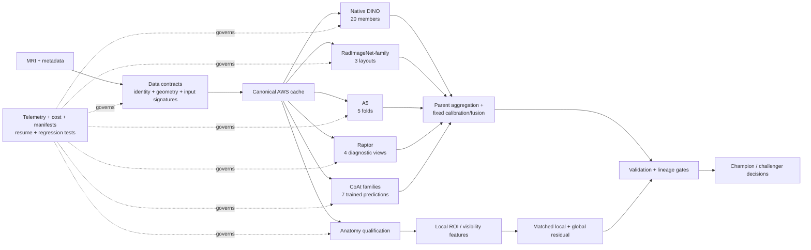

# RSNA Knee Abnormality Detection

**End-to-end MRI machine-learning research: leakage-aware validation, heterogeneous deep-learning reconstruction, anatomy-aware representation learning, GPU-aware inference, and production-style experiment engineering on AWS.**

A notebook-first project by **Alvaro Mendizabal** for twelve knee-MRI findings. AWS/SageMaker is the canonical private research environment; this repository is the curated employer-facing and semi-reproducible layer. Raw MRI, identifiers, row-level predictions, private checkpoints, recovery bundles, and competition-specific inference logic stay outside Git history.

> **Current verified publication boundary: Stage 96 anatomy qualification.** The project retains a verified external macro ROC-AUC of **0.943**, has restored the major trained parent branches on the available input scope, completed validation/acquisition and DICOM-geometry audits, and advanced into a gated anatomy-localization program without claiming unmeasured improvements.

## 30-second overview

| | |
|---|---|
| **Problem** | Multi-label abnormality detection from heterogeneous knee MRI studies |
| **My ownership** | Data contracts, validation, modeling, inference, cloud execution, failure recovery, experiment design, reproducibility, and public documentation |
| **Scale** | 4,407-study canonical cache; 4,349 grouped development rows; 59 scanner groups |
| **System** | Multi-branch DINO, RadImageNet, A5, Raptor, and CoAt-family parent with target-specific fusion |
| **Engineering** | SageMaker + private S3, resumable runners, checkpoint streaming, numerical-parity gates, telemetry, cost bounds, CI |
| **Research discipline** | Matched controls, grouped validation, scientific negative results, immutable evidence, explicit promotion/kill gates |
| **Current frontier** | Parent-preserving anatomical localization, visibility-aware supervision, and local/global fusion |

### What employers should notice

- **I treated the project as a system, not a notebook.** Data lineage, model state, validation membership, input signatures, runtime behavior, artifact recovery, and publication policy are all first-class.
- **I preserved scientific attribution.** New branches are compared against matched controls; engineering parity is not mislabeled as model improvement.
- **I made failures reusable.** Avoidable implementation failures became regression tests before the next cost-bearing run.
- **I managed cloud constraints deliberately.** Large checkpoints stream from private storage, completed work resumes, and resource/cost limits are built into execution.
- **I closed weak ideas.** Fixed spatial bias, frozen foundation transfer, and a geometry-defect hypothesis were retained as useful negative evidence rather than tuned until favorable.
- **I protect the competitive implementation.** Public artifacts show the engineering and research method without exposing restricted data or private fusion logic.

## System architecture

For the detailed view, read **[System architecture](docs/ARCHITECTURE.md)**.

## Verified evidence

| Evidence boundary | Verified state |
|---|---:|
| External macro ROC-AUC | **0.943** |
| Canonical exact-window cache | **4,407 studies / 69.14 GiB** |
| Grouped research rows | **4,349 non-gold / 58 fully labeled audit rows** |
| Scanner groups | **59; zero cross-fold leakage** |
| Native parent branch | **20 trained members / 200 window evaluations** |
| A5 parent branch | **5/5 trained folds** |
| Rad parent branch | **3 source layouts / multiple trained heads** |
| Raptor diagnostic views | **4/4 completed on explicitly incomplete input scope** |
| CoAt-family execution | **8/8 source/checkpoint gates; 7/7 trained predictions** |
| Validation/acquisition audit | **7/7 units completed** |
| Geometry audit | **2,287 headers + 93 images; zero flags in inspected scope** |
| Anatomy qualification | **4/4 tracks completed; real segmentation pilot is next** |

Internal grouped metrics are model-selection evidence and are not presented as interchangeable with the external score.

## Research decisions that matter

| Question | Decision |
|---|---|
| Should a fixed spatial branch be expanded? | **No.** Executed correctly; aggregate evidence was negative. |
| Should frozen orthopedic foundation features replace task-aligned work? | **No.** Valid negative screen; route closed. |
| Is DICOM geometry the likely missing capability on the inspected inputs? | **No evidence of it.** 2,287 headers screened with zero flags. |
| Should engineering reconstruction results be called new model gains? | **No.** Execution correctness and predictive improvement stay separate. |
| Is there an untouched fully labeled confirmation cohort in the unchanged catalog? | **No.** Selection lineage prevents that claim. |
| What capability is still genuinely missing? | **Explicit anatomy-aware localization and visibility-conditioned local/global evidence.** |

See **[Research timeline](docs/RESEARCH_TIMELINE.md)** for the full decision path.

## Start here

### 2-minute recruiter review
1. **README** — this page.
2. **[Employer case study](docs/EMPLOYER_CASE_STUDY.md)** — problem, ownership, decisions, engineering, outcomes.
3. **[Notebook 13](notebooks/13_parent_reconstruction_and_anatomy_qualification.ipynb)** — current aggregate research frontier.

### 10-minute ML engineering review
1. **[System architecture](docs/ARCHITECTURE.md)**
2. **[Parent reconstruction frontier](docs/PARENT_RECONSTRUCTION_FRONTIER.md)**
3. **[Reproducibility boundary](docs/REPRODUCIBILITY.md)**
4. **[Project status](docs/PROJECT_STATUS.md)**

### 15-minute research review
1. **[Research timeline](docs/RESEARCH_TIMELINE.md)**
2. **[Anatomy-aware transfer program](docs/ANATOMY_AWARE_TRANSFER_PROGRAM.md)**
3. **[Anatomy model qualification](docs/ANATOMY_MODEL_QUALIFICATION.md)**
4. **[AWS research frontier](docs/AWS_RESIDUAL_FRONTIER.md)**

## Technical stack

**Modeling:** Python, PyTorch, scikit-learn, DINO-style vision encoders, RadImageNet transfer, CoAtNet-family models, multi-view aggregation, calibration, residual modeling.

**Medical imaging:** DICOM metadata/geometry, 2.5D and volumetric representations, multi-plane MRI, anatomy-aware localization, segmentation transfer.

**Cloud / ML engineering:** AWS SageMaker, S3, GPU inference, resumable jobs, content-addressed artifacts, immutable manifests, resource telemetry, cost guards.

**Quality / reproducibility:** grouped validation, leakage audits, numerical-parity tests, regression fixtures, CI publication gates, executed Jupyter notebooks, Plotly/SVG persistence.

## Public reproducibility

The public layer is dependency-light and designed to fail loudly when the published evidence drifts.

Run:

    python -m unittest discover -s tests -p 'test_current_frontier.py'
    python -m unittest discover -s tests -p 'test_anatomy_qualification.py'
    python -m unittest discover -s tests -p 'test_employer_portfolio.py'
    python tools/check_current_frontier.py

GitHub Actions runs the publication and public-quality gates on pushes and pull requests. See **[Reproducibility](docs/REPRODUCIBILITY.md)**.

## Notebook guide

- [01 — Metadata and representation audit](notebooks/01_metadata_and_representation_audit.ipynb)
- [02 — Protocol feature investigation](notebooks/02_protocol_feature_investigation.ipynb)
- [03 — Image-context feature investigation](notebooks/03_image_context_feature_investigation.ipynb)
- [04 — Supervision and validation](notebooks/04_supervision_and_validation.ipynb)
- [05 — Multilingual teacher feasibility](notebooks/05_multilingual_teacher_pilot.ipynb)
- [06 — Image models and replication](notebooks/06_image_models_and_replication.ipynb)
- [07 — Full-data training frontier](notebooks/07_deployment_and_training_frontier.ipynb)
- [08 — Heterogeneous ensemble and deployment validation](notebooks/08_heterogeneous_ensemble_and_deployment_validation.ipynb)
- [09 — Scored-reference recovery and runtime](notebooks/09_scored_reference_recovery_and_runtime.ipynb)
- [10 — AWS-only residual frontier](notebooks/10_aws_only_residual_frontier.ipynb)
- [11 — Residual confirmation and submission boundary](notebooks/11_residual_confirmation_and_submission_boundary.ipynb)
- [12 — Owned residual and representation frontier](notebooks/12_owned_residual_and_representation_frontier.ipynb)
- **[13 — Parent reconstruction and anatomy qualification](notebooks/13_parent_reconstruction_and_anatomy_qualification.ipynb)** — current public entry point

## Public repository versus private AWS workspace

**Public**
- aggregate validation and reconstruction evidence
- architecture and research narratives
- promotion/closure decisions
- public-safe helper code and tests
- CI publication gates
- executed aggregate notebooks

**Private by design**
- MRI/DICOM data and reports
- study identifiers and scanner assignments
- row-level OOF/test predictions
- cache shards and memmaps
- model weights/checkpoints
- private source-recovery handles
- cloud paths and credentials
- return bundles and orchestration packages
- exact competition inference/submission implementation

No diagnostic or clinical use is claimed.
