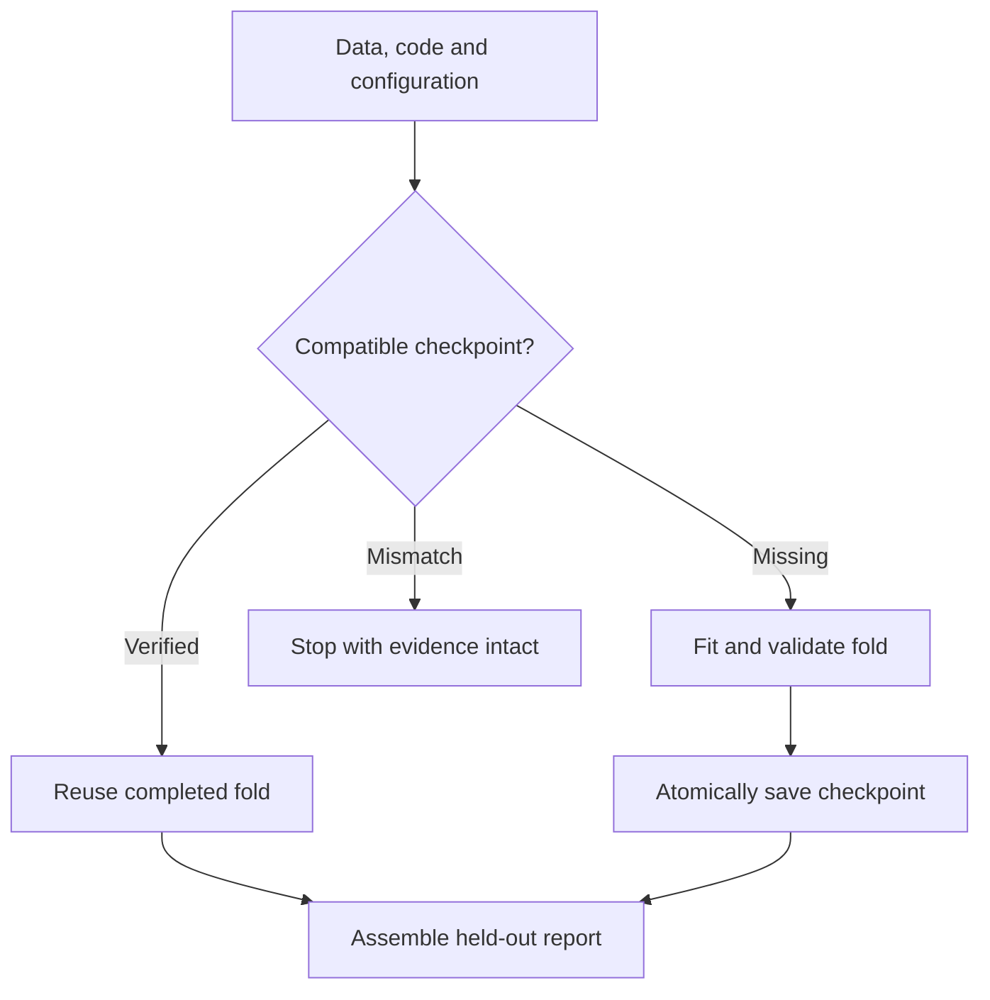

# System architecture

The project has two execution surfaces. The original research uses private MRI and model artifacts on AWS. The public review surface runs entirely on synthetic features and retained aggregate reports. They share engineering principles; the public demonstration does not reproduce the private model or its scientific scores.

## Data and model identity

A model's effective identity includes source state, selected acquisitions, image transforms, target order, fitted aggregation, and evaluation membership. A restored checkpoint alone cannot establish equivalence. The research therefore kept input signatures and numerical-parity gates alongside weights.

The canonical cache contains **4,407 studies**. The retained grouped development population contains **4,349 studies in 59 scanner groups**, with zero scanner groups crossing folds. The **58 fully labeled audit rows** have historical selection exposure and are not treated as untouched confirmation.

## Research execution

| Layer | Responsibility | Public evidence |
|---|---|---|
| Data contracts | Schema, joins, DICOM geometry, acquisition coverage | [Protocol](RESEARCH_PROTOCOL.md) and public helpers |
| Heterogeneous models | Restore trained branches with strict source and input identity | [Historical reconstruction record](SCORED_REFERENCE_FRONTIER.md) |
| Experiment control | Resume compatible work, monitor resources, preserve failures | [Engineering case study](EMPLOYER_CASE_STUDY.md) |
| Evaluation | Grouped development metrics, parity checks, paired uncertainty | [Executed research notebook](../notebooks/14_winner_transfer_and_context_modeling.ipynb) |
| Publication | Aggregate results, reviewable code, restricted-artifact checks | [Publication procedure](GIT_PUBLICATION.md) |

The reconstruction record includes 20 native trained members, five A5 folds, four Raptor diagnostic views on incomplete input scope, and seven CoAt predictions. Complete historical parity is not claimed while compatible source inputs and independent evaluation membership remain unresolved. Exact private aggregation and inference implementation are excluded.

## Public pipeline

[Source](../src/rsna_review/public_pipeline.py) · [CLI](../examples/run_public_pipeline.py) · [Tests](../tests/test_public_pipeline.py)

The CPU demonstration generates synthetic features and twelve binary targets. Scanner-disjoint folds, train-only normalization, and a generic logistic model produce held-out predictions. Every number in this demonstration describes generated data only.

A manifest binds input, configuration, implementation, and runtime identity. Checkpoint content hashes are validated before reuse. The same command can resume a deliberately interrupted run; tests compare its completed output against a fresh run. Incompatible or damaged state is rejected rather than silently reused.

## Evidence classes

| Class | What it supports | What it does not support |
|---|---|---|
| Recorded external evaluation | Historical project performance in that setting | Current clinical performance |
| Grouped development evaluation | Controlled research comparisons | Independent confirmation after repeated selection |
| Engineering parity | Equivalence within tested inputs and tolerances | Generalization to untested acquisitions |
| Synthetic demonstration | Code behavior, contracts, recovery | MRI diagnostic accuracy |

Ordered cross-slice context improved the retained grouped result from **0.7943834 to 0.7978448**. A later extension reached **0.7978946**, but its paired interval crossed zero. The public record preserves both the useful improvement and the uncertainty.

## Publication boundary

Public artifacts include aggregate reports, executed aggregate notebooks, generic helpers, synthetic data generation, tests, and diagrams. Raw MRI, patient/study identifiers, research row-level predictions, model weights, private runners, cloud paths, and exact inference/fusion logic remain excluded. See [Reproducibility](REPRODUCIBILITY.md) for the supported environment and commands.
