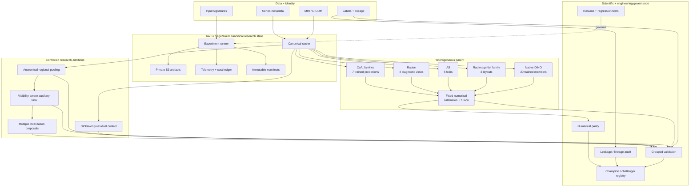
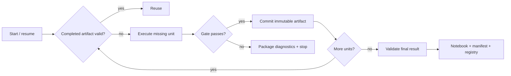
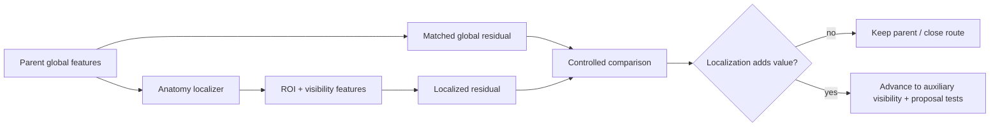

# System architecture

## Overview

This project is organized as a **research system**, not a single model. The scored parent combines heterogeneous image-model families, fitted numerical aggregation, strict input identity, and an experiment-control layer that governs validation, cost, resumability, and promotion.

## Design principle: model identity includes data identity

A checkpoint alone is not treated as the model.

The effective model identity includes:

- checkpoint/source state;
- selected series and slices;
- image transforms;
- target order;
- fitted aggregation/calibration;
- evaluation membership.

When newly recovered acquisitions change selected pixels, only affected branches are invalidated. Unaffected outputs remain reusable.

## Parent component status

| Component | Public-safe status | Why it matters |
|---|---|---|
| Native DINO | 20 trained members / 200 member-window evaluations | Strong heterogeneous image representation |
| RadImageNet family | 3 source layouts / multiple trained heads | Medical-pretraining diversity |
| A5 | 5/5 trained folds | Complementary learned branch |
| Raptor | 4/4 diagnostic views on partial input scope | Additional spatial/model diversity |
| CoAt families | 8/8 gates + 7/7 trained predictions | Recovered spatial/depth aggregation families |
| Numerical graph | Fixed fitted calibration/fusion preserved | Prevents accidental retraining during restoration |

Full historical parity is deliberately not claimed while complete compatible acquisitions and independent evaluation membership remain unresolved.

## Control plane

The research control plane is as important as the model graph.

### Before execution
- verify artifact/source identity;
- discover hardware and disk headroom;
- run deterministic self-tests;
- validate metric/evaluation contract;
- benchmark representative worker/batch choices when needed.

### During execution
- emit timestamped heartbeats;
- track completed/total/remaining work;
- record process/system/GPU memory;
- preserve current and peak utilization;
- accumulate estimated compute cost;
- checkpoint independently reusable units.

### After execution
- validate outputs;
- compare numerical parity where relevant;
- write immutable manifests;
- update the experiment registry;
- produce one compact return bundle;
- preserve nonzero failure status if the run failed.

## Failure recovery

This design prevents a late failure from forcing expensive earlier stages to rerun.

## Validation architecture

The project separates four evidence classes:

1. **External recorded performance** — comparable public result.
2. **Grouped internal development evidence** — model-selection research.
3. **Engineering parity** — source/runtime equivalence checks.
4. **Exploratory analysis** — useful but not independent confirmation.

They are intentionally not collapsed into one score.

## Anatomy-aware extension

The current research program adds a new capability without replacing the parent.

Missing or low-confidence anatomical evidence must fall back exactly to the parent.

## Public/private architecture boundary

**Public GitHub:** aggregate metrics, diagrams, experiment contracts, public-safe helpers, tests, CI, executed aggregate notebooks.

**Private AWS/S3:** raw MRI, identifiers, row-level predictions, checkpoints, private runners, source handles, exact competition fusion logic, resumable heavy artifacts.

This split makes the repository reviewable and partially reproducible without leaking restricted data or competitive implementation.
