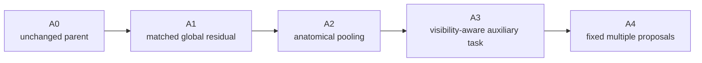

# Research timeline and decision log

This document presents the project as a sequence of **questions, evidence, and decisions** rather than a list of experiments.

## Phase 1 — data and validation foundation

### Question
Can model comparisons be made without scanner/entity leakage and without mixing external and internal evaluation settings?

### Work
- canonical image cache;
- scanner-grouped folds;
- metric contracts;
- audit-only labeled rows;
- metadata/representation investigation.

### Decision
Use scanner-disjoint grouped development evidence for research while keeping external recorded performance separate.

---

## Phase 2 — targeted complementary modeling

### Question
Can difficult targets benefit from specialized residual signal without changing every output?

### Work
- target-specific residual modeling;
- matched controls;
- protected unaffected targets;
- grouped validation.

### Decision
Retain a positive development challenger. Do not generalize a target-specific improvement into a universal blend rule.

---

## Phase 3 — representation-diversity screens

### Fixed spatial bias

**Hypothesis:** generic spatial structure adds useful complementary evidence.

**Result:** negative aggregate screen.

**Decision:** close the tested configuration. Do not confuse fixed regions with supervised anatomy.

### Frozen orthopedic foundation features

**Hypothesis:** domain-specific frozen features add complementary signal.

**Result:** valid negative matched screen.

**Decision:** close the frozen-transfer configuration. Domain pretraining alone is not enough.

---

## Phase 4 — parent-first reconstruction

### Question
Are surrogate systems the right control, or should new work be attached to the actual scored parent?

### Work
- preserve the source-defined parent;
- restore Rad execution;
- restore 20-member native DINO branch;
- restore 5 A5 folds;
- recover Raptor assets/views;
- recover and execute CoAt-family paths;
- preserve fixed numerical fusion/calibration.

### Decision
Use the heterogeneous parent as the research control.

Engineering parity is necessary but is not presented as new predictive improvement.

---

## Phase 5 — validation and acquisition lineage

### Question
Which rows and acquisitions support legitimate model claims?

### Work
- checkpoint-selection membership audit;
- acquisition coverage audit;
- missing-file inventory;
- explicit incomplete-input signatures.

### Result
- 58 fully labeled studies;
- no fully labeled studies outside the recovered selection lineage in the unchanged catalog;
- 77 of 152 declared series present in the scoped mirror;
- 75 absent;
- explicit missing-file evidence preserved.

### Decision
Do not invent untouched confirmation membership. Do not relabel partial-input predictions as complete.

---

## Phase 6 — source recovery boundary

### Question
Can missing source images be recovered through the currently authorized path?

### Result
Protected file access remained blocked before new raw images were downloaded.

### Decision
Stop the unchanged retry path. Preserve independent AWS work instead of attempting to bypass access controls.

---

## Phase 7 — DICOM geometry hypothesis

### Question
Could slice ordering, physical spacing, or frame/plane metadata explain a major modeling limitation?

### Work
- 2,287 real headers;
- 77 series;
- 26 studies;
- 93 local decoded images.

### Result
Zero geometry flags and zero unevaluable series in the inspected scope.

### Decision
Close this hypothesis for the inspected inputs unless materially new data arrive.

---

## Phase 8 — anatomy-aware ceiling escape

### Question
What capability remains genuinely missing after attention, medical pretraining, multi-plane context, depth modeling, and ensemble diversity are already present?

### Answer
Explicit anatomical localization with visibility-aware local/global evidence routing.

### Stage 96 qualification
Completed:

- 4/4 tracks;
- two checkpoint metadata payloads reviewed;
- nine foreground anatomy labels;
- three coordinate adapters;
- exact parent fallback checks on ten saved component arrays.

### Decision
Advance to a frozen reference-inference pilot.

Do not train an anatomy-conditioned disease model until the localizer clears its predeclared reference gate.

---

## Current controlled research plan

Interpretation:

- **A2 − A1** isolates localization;
- **A3 − A2** isolates auxiliary visibility supervision;
- **A4 − A3** isolates proposal uncertainty without another fit.

Missing/low-confidence localized evidence must preserve the parent exactly.

## Research principles carried forward

- retain valid small positive evidence;
- close valid negative hypotheses;
- do not rewrite historical evaluation boundaries;
- do not use infrastructure progress as a proxy for predictive improvement;
- keep source/data identity part of model identity;
- require explicit promotion and kill gates;
- reuse completed expensive work.
